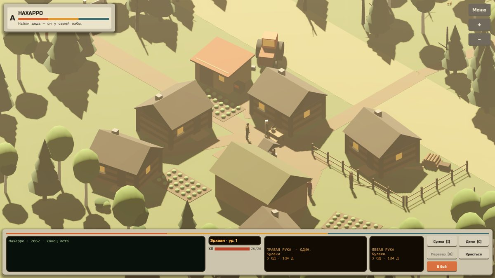
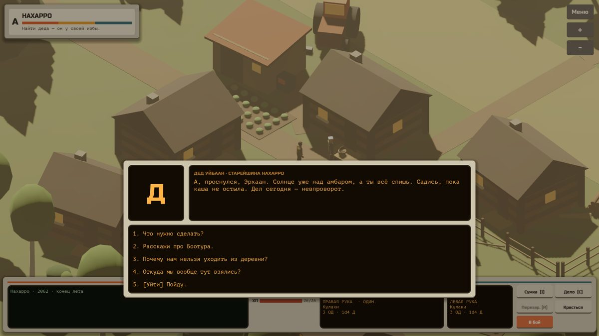
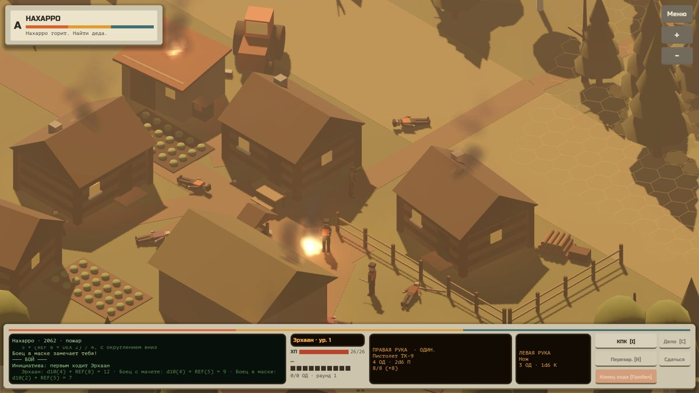

# Нахарро

Постапокалиптическая RPG про Якутию 2062 года: изометрия, кассетный футуризм и пошаговый бой на гексах.
Проект перенесён на **Godot 4.7** из HTML-прототипа «Недострой». Боевые правила и ИИ перенесены из прототипа один в один.

Сейчас в игре есть **пролог**: деревня Нахарро, утро с обучением, лес, налёт, бой у амбара, смерть деда, КПК и уход за черту.



| | |
|---|---|
|  |  |

## Как запустить

1. Скачай Godot 4.7 (обычную версию, не .NET) с [godotengine.org](https://godotengine.org/download).
2. Скачай этот репозиторий: зелёная кнопка **Code → Download ZIP**, затем распакуй. Можно и через `git clone`.
3. Запусти Godot, нажми **Import**, выбери файл `project.godot` в папке проекта.
4. Когда проект откроется, нажми **▶** (F5) в правом верхнем углу.

Первый запуск займёт полминуты: Godot импортирует модели и шрифты.

## Управление

| Что | Как |
|---|---|
| Идти (вне боя — куда угодно, в бою — по гексам), говорить, подобрать, обыскать | левый клик |
| Красться | Z |
| Остановиться | правый клик |
| Масштаб | колёсико, кнопки «+» и «−» |
| КПК или сумка | I |
| Дело (лист персонажа) | C |
| Перезарядка | R |
| Сменить руку | Tab |
| Прицельный удар (выбор зоны) | A или клик по оружию |
| Конец хода | Пробел |
| Быстрое сохранение и загрузка | F5 и F9 |
| Пауза и меню | Esc |

## Что где лежит

```
data/                 ← тексты и цифры, правятся без программирования
  dialogs/*.json      диалоги (дед, Степан, Варвара, Мичил, мысли героя)
  characters.json     персонажи: характеристики, оружие, броня, лут, внешность
  weapons.json        оружие
  items.json          предметы и аптечки
  quests.json         задания
  intro.json          вступительные и финальные слайды
scenes/
  main.tscn           главная сцена (запускается первой)
  locations/          локации (сейчас одна: nakharro.tscn)
  props/              избы, амбар, деревья, забор, огонь…
scripts/
  core/rules.gd       ВСЕ правила: броски, ОД, попадание, броня, опыт
  core/game_state.gd  герой, флаги, задания, сохранения
  combat/             бой на гексах и ИИ врагов
  world/              персонажи, предметы, гексовая сетка, локация
  locations/          сюжет конкретной локации (nakharro.gd)
  ui/                 интерфейс: панель, диалоги, КПК, дело, меню
assets/               модель героя, шрифты, материалы
tools/                автотест и генератор сцен (для разработки)
```

## Правила боя (из прототипа)

- **ОД за ход** = 5 + ⌊(Рефлексы + Ловкость) / 4⌋. Если ранен ниже 50% ХП, на 1 меньше.
- **ХП** = Тело×2 + Рефлексы×2 + d10 (d10 бросается один раз при создании).
- **Атака**: d10 + характеристика оружия + навык + бонус − прицел − дальность − очередь.
- **Атака из скрытности**: если напасть, пока крадёшься, первая атака героя получает ×5 к модификатору попадания и ×5 к урону (`Rules.SNEAK_MULT`).
- **Уклонение**: d10 + Ловкость + «Уклонение» + оборона. Попадание засчитывается, только если атака выше уклонения.
- **d10**: на 10 кубик взрывается (перебрасываешь и прибавляешь), на 1 — провал (из единицы вычитается ещё d10).
- **Зоны** (d6 или прицельно): голова ×3 (−6), шея ×2 (−4), торс ×1 (−2), руки ×1 (−2), пах ×2 (−4, без брони), ноги ×1 (−2).
- **Броня по типу урона**: К режет 25% в броню и 50% в ХП, Р — 50% и 50%, Д и П бьют полностью и по броне, и по ХП. Пробитая броня не защищает.
- **Несъеденные ОД** в конце хода дают оборону: половину остатка прибавляешь к уклонению.
- **Раны**: −3 к урону ниже 70% ХП, −5 ниже 50%.
- **Опыт**: для следующего уровня нужно 100 × номер уровня, накопительно.

Все числа лежат в `scripts/core/rules.gd` и `data/*.json`.

## Как писать диалоги

Каждый диалог — файл в `data/dialogs/`. Он состоит из узлов, у каждого узла есть текст и варианты ответа:

```json
{
  "speaker": "Степан",
  "title": "Степан · плотник",
  "nodes": {
    "start": {
      "text": "Здорово. Видишь дыру в заборе?",
      "options": [
        {"text": "Вот доски.", "next": "planks", "if": {"item": "planks"}},
        {"text": "[Механика] Прибью сам.", "check": {"stat": "CRA", "skill": "Механика", "dc": 10},
         "success": "fix_ok", "fail": "fix_bad"},
        {"text": "[Уйти]", "next": null}
      ]
    }
  }
}
```

Что можно писать в варианте ответа:

- `next` — следующий узел, `null` закрывает разговор.
- `if` — вариант показывается при условии: `flag`, `not_flag`, `item`, `no_item`, `quest` вместе с `stage` / `stage_min` / `stage_max`, `hurt` (герой ранен), `humanity_min` / `humanity_max` (человечность не ниже / не выше).
- `check` — проверка навыка (d10 + характеристика + навык против `dc`). Дальше идут `success` и `fail`.
- `give` и `take` — дать или забрать предметы: `{"knife": 1}`.
- `set_flags` — поставить флаги: `{"fence_done": true}`.
- `quest` — сдвинуть задание: `{"id": "chores", "stage": 2}`.
- `xp` — дать опыт.
- `note` — добавить запись в КПК.
- `humanity` — сдвинуть человечность героя: `5` за добрый поступок, `-10` за жестокий (шкала 0–100).
- `action` — вызвать действие из скрипта локации (например `barn_fight`).

В узле можно указать `text_if`: другой текст, когда выполнено условие. `{hero}` в тексте заменяется именем героя.

## Как править деревню

Открой `scenes/locations/nakharro.tscn` и двигай избы, деревья и заборы мышью.
**Гексовая сетка строится сама**: всё, у чего есть коллизия (узел `Collision`), становится непроходимым.

- Персонаж — узел в `Characters` со скриптом `character.gd`. В инспекторе задаются шаблон (`char_id` из `characters.json`), диалог, враждебность, радиус обнаружения, отряд, «лежит мёртвым».
- Предмет — узел в `Items` со скриптом `interactable.gd`: ключ предмета, количество, подпись.
- Узлы в группе `phase_morning` видны только утром, узлы в группе `phase_raid` — во время и после налёта.
- Сюжет пролога (фазы, триггеры, выстрел в деда, сборка КПК) описан в `scripts/locations/nakharro.gd`.

`tools/build_scenes.gd` собрал стартовую деревню из кода. Если его запустить, он перезапишет сцену. Правь сцену в редакторе и этот скрипт не трогай.

## Автотест

В проекте есть автотест: он проходит весь пролог сам, от меню до экрана «Конец пролога».

```
godot --headless --path . res://tools/smoke_test.tscn
```

В конце он печатает строку `ИТОГ: ошибок 0`, если всё работает.

## Что дальше

- [ ] Акт I: соседнее поселение, след Боотура, чистильщики.
- [ ] Звуки и музыка (в прототипе их синтезировал WebAudio, здесь пока тишина).
- [ ] Портреты в диалогах (сейчас на экране буква имени).
- [ ] Настоящие модели вместо брусков для жителей и врагов.
- [ ] Эффект конуса зрения и зернистости из прототипа (пост-шейдер).
- [ ] Карта мира и переходы между локациями.

Шрифты Russo One и PT Mono распространяются по лицензии SIL Open Font License (`assets/fonts/OFL-*.txt`).
